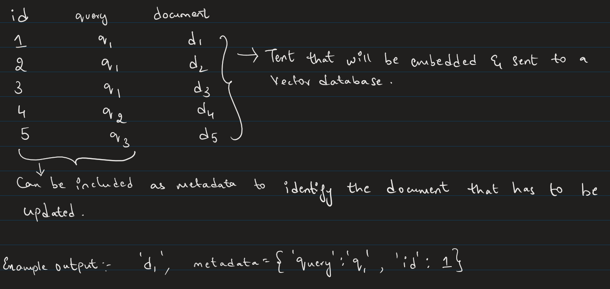
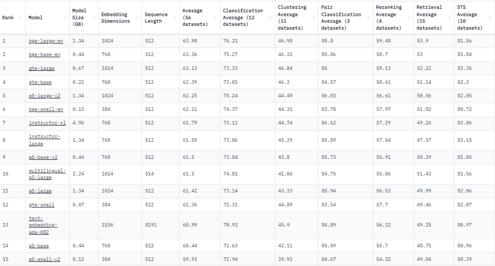

## 1. If you have to build a solution a small API to expose a datascience endpoint, what tech stack you prefer?
A. Once we have developed an ML model, there are multiple ways to deploy the model as a web application. The tech stack I'd prefer using to build an API would be Flask, as in my current role I have experience building a solution as a MaaS (Model as a Service) using Flask. You can combine this with postgres if you want to establish a DB connection for your Flask app.

---

## 2. If we have our data in MongoDB,  you need to batch process every hour and do text classification on the latest 1 hour data? How do you achieve this?
A. Honestly, I don’t have experience working with MongoDB or non-relational databases. If I were to do this using postgres, I would try to fetch the data that was created in the last hour using an SQL query with a condition for created_date column which would have the timestamps of the data that were inserted to the table. Once we fetch the required data then we can perform text classification using any pre-trained or fine-tuned model.  

To batch process every hour, I don’t have much idea on this but I remember postgres having a functionality like sort of a scheduler that would run the same tasks at specified time intervals. I haven't worked on any such projects that uses this feature till now. I believe even MongoDB has a similar feature.

---

## 3. Build vs Buy, how do you decide whether to use third-party LLM or home grown deployment? What are the parameters you will analyse to decide that?
A. In most cases it would depend on what the use-case is. 
Building your own model from scratch is not feasible especially when you already have pre-trained models avaialble.  

**Data Collection** - If you are building a model from scratch, it would need large datasets for better performance and collecting the data would require lot of human effort, time and resources.  

**Infrastructure** - Even if you manage to collect the data training those would require powerful computing resources which is not feasible.
 
Whereas, pre-trained models are already trained on such large corpus of data, we can use it to finetune for our domain specific usage, where data collection is not a big problem and we can do it with considerable computational power. Ofcourse, though pre-trained models are available, not all are available for commercial use for free. Open-source models are what we would need to build solutions as licensed model may be expensive and they come along with lot of terms and conditions.

---

## 4. You have a vector database (any of your choice), you index some docs, pdf and csv file contents in it. Now, I want to remove few outdated docs from the index and add few more additional updated documents? How do you do that scalably? 
A. We can create a unique ID while indexing the docs. So each document/docs (text) will have an unique ID along with it while we index the documents and store it in a vector database. We can store those ID's as metadata which would be easy to update the old or outdated documents.  

We can use the metadata information to discard/update the documents.

---

## 5. If you need to perform similarity search on corpus of data to suggest 5 related content, what model and DB do your choose?
A.  We would need to first choose a embedding model, we can refer the hugging face leaderboard to check out which text embedding model performs better and we can choose a model based on the size of model and our available GPU resource. Since we want to perform semantic search, we can look for models which have good scores for Retrieval. To suggest 5 related content, we pass in an argument top_k which would return the top 5 related content using cosine similarity score. 

I prefer using this model which gave me good results and doesn't require large space or GPU resource. 
**sentence-transformers/all-MiniLM-L6-v2**

The Databases that you would need to use for these kind of tasks would be vector databases, where your text embeddings would be stored as a high dimensional vector. ElasticSearch is a widely used vector database, but it requires knowledge of parameters that you would need, personally I don’t have experience working with elastic search. For my research tasks I prefer using FAISS from facebook, which is free and opensource, it is scalable and provides built in GPU support.

